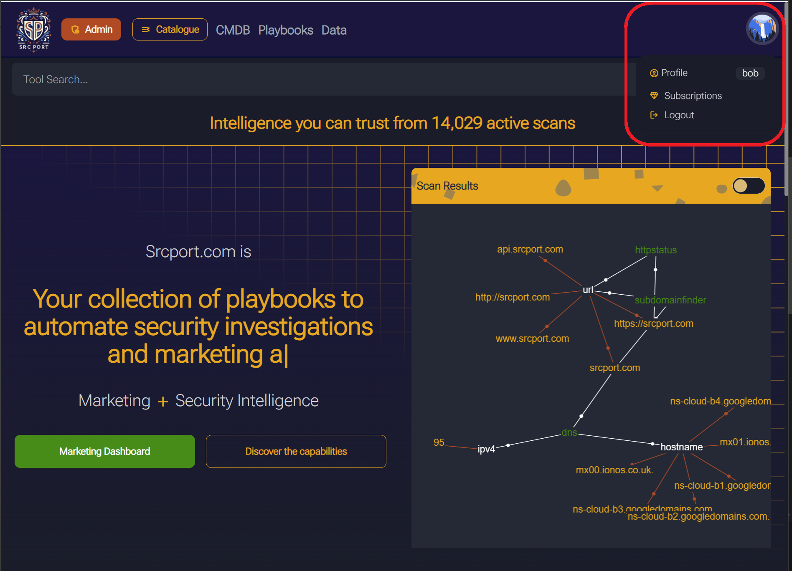
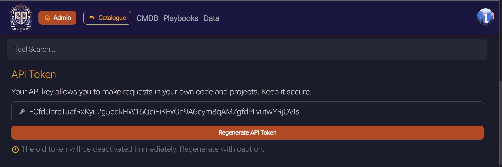
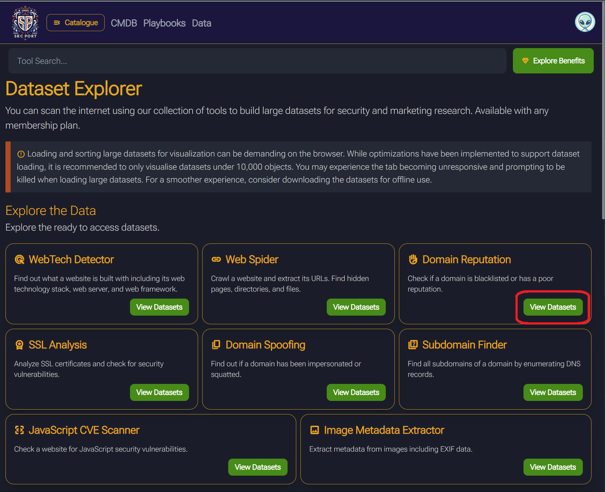
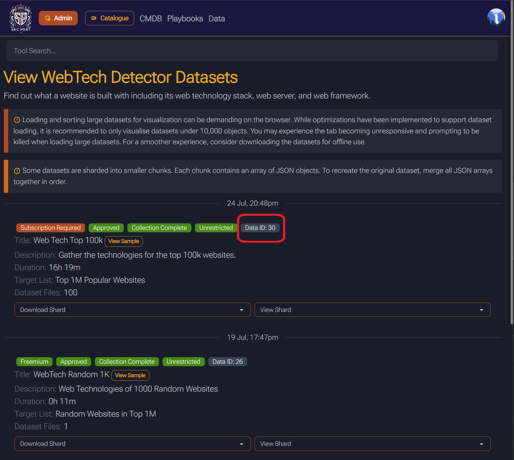

# Dataset Downloader

This python script can be used to download datasets from srcport.com and convert them into other formats. The default format for data is `json`, this script allows you to convert them to `csv` for use in libre office / excel. When provided with the `id` of a dataset (which can be obtained by viewing the dataset on srcport.com) the script will download all dataset sharts and then convert it into the specified format.

## Requirements

The script requires the following:

- Install python3
- Install the `requests` package with `pip3 install requests` or similar
- Paid subscription to srcport.com
- API key from the profile page of srcport.com

## Usage 

To run the script execute the following:

```bash
python .\dataset-downloader.py --api-key <API KEY> --data-id <ID>
```

The script has the following options:

| Option                    | Description                                                                                                     |
|---------------------------|-----------------------------------------------------------------------------------------------------------------|
| `-h`, `--help`            | Show this help message and exit                                                                                 |
| `--api-key API_KEY`       | Enter your srcport.com account API key. You can find this by logging into your account on the profile page.      |
| `--data-id DATA_ID`       | Enter the ID of the dataset you want to download                                                                |
| `--data-format DATA_FORMAT` | Enter the format you want the data in                                                                          |
| `--join-shards JOIN_SHARDS` | If true, all dataset shards will be joined into a single file                                                   |
| `--hostname HOSTNAME`     | Enter the hostname of the API server                                                                             |
| `--output-dir OUTPUT_DIR` | Specify the output directory                                                                                     |

## Find your API key

Your API key can be found on your profile page. Once logged in, click the profile button under your account image.



Your API key can be viewed on this page.



## Find the dataset ID

To find the ID of the dataset you want to download, view the dataset explorer page.



Then you can view the data ID of the dataset in the badge at the bottom of the page.

